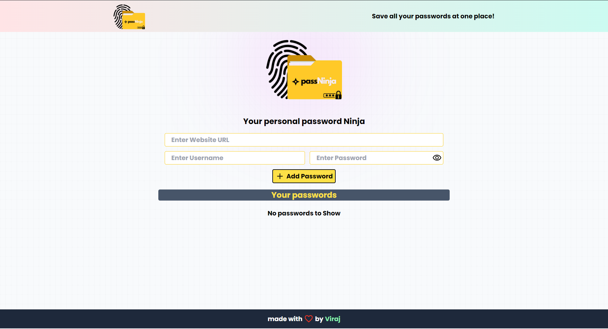

# passNinja

A full stack web application which takes input as website name, username and password and stores it in the databse.Made using React for frontend, Express.Js for backend and MongoDB as database for storing the passwords and Vite is used for the server.


## Run Locally

Clone the project

```bash
  git clone https://github.com/viraj-ap/passNinja.git
```


Install dependencies

```bash
  npm install 
```

Start the server

```bash
  npm run dev
```
make sure you have your own MONGO_URI and local host port.


## Screenshots



